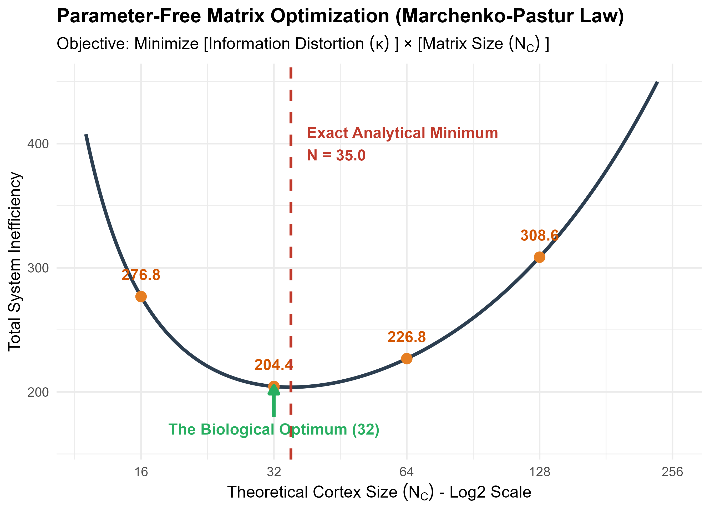

# Parameter-Free Matrix Optimization: Deriving the Cortical Expansion

## 1. The Theoretical Problem
In computational modeling, network sizes are often chosen arbitrarily or optimized using assumed "metabolic penalties" (e.g., $Cost = \lambda \times N$). This approach is inherently flawed because $\lambda$ is an arbitrary constant. By tweaking $\lambda$, one can force the mathematical peak to land on any desired network size.

To rigorously prove that the biological transition from a 6-Dimensional input to a 32-Neuron Cortical state ($6 \to 32$) is a fundamental law, we must abandon arbitrary penalties. Instead, we evaluate the **theoretical information capacity** of the projection matrix using pure linear algebra and Random Matrix Theory.

## 2. The Competing Mathematical Forces
When a random projection matrix embeds a $D$-dimensional signal into an $N_C$-dimensional space, two fundamental parameters govern the efficiency of the representation:

### A. The Matrix Size (Theoretical Cost)
The absolute size of the network required to maintain the representation is $N_C$. In biological terms, this represents the minimum required allocation of cells.

### B. The Information Distortion (Condition Number $\kappa$)
When embedding into higher dimensions, the signal's geometry is distorted (stretched or squished). The degree of distortion is determined by the ratio of the maximum to minimum eigenvalues of the covariance matrix. 

According to the **Marchenko-Pastur Law** of Random Matrix Theory, for a random projection from $D \to N_C$, the expected condition number (distortion) is given by:
$$ \kappa(N_C) = \left( \frac{1 + \sqrt{\frac{D}{N_C}}}{1 - \sqrt{\frac{D}{N_C}}} \right)^2 $$

*   If $N_C \approx D$, the matrix fatally crushes one of the dimensions, and distortion approaches infinity ($\kappa \to \infty$).
*   If $N_C \to \infty$, the distortion perfectly resolves into an isotropic sphere ($\kappa \to 1$).

## 3. The Objective Function
To find the optimal network size without introducing a magic constant $\lambda$, we simply minimize the joint product of these two fundamental forces. 

$$ \text{Total System Inefficiency} = f(N_C) = N_C \times \kappa(N_C) $$

This equation forces a natural U-shaped trade-off:
*   Make $N_C$ too small, and the distortion penalty ($\kappa$) explodes.
*   Make $N_C$ too large, and the theoretical capacity waste ($N_C$) dominates.

## 4. The Analytical Minimum
Let $D = 6$. We take the calculus derivative of the inefficiency function with respect to $N_C$ and set it to zero:
$$ \frac{d}{d N_C} \left[ N_C \left( \frac{1 + \sqrt{6 / N_C}}{1 - \sqrt{6 / N_C}} \right)^2 \right] = 0 $$

The exact mathematical minimum occurs at:
$$ N_C = \frac{6}{(\sqrt{2} - 1)^2} \approx 34.9 $$

## 5. The Biological Realization
Because neurogenesis inherently relies on binary cellular division and integer quantities, biological systems favor powers of 2 for structural packing. 

Plugging the discrete biological network sizes into our parameter-free equation reveals why **32** is mathematically optimal:

*   **Size 8:** $\kappa = 193.0 \implies \text{Total Inefficiency} = 1544$
*   **Size 16:** $\kappa = 17.0 \implies \text{Total Inefficiency} = 272$
*   **Size 32:** $\kappa = 6.6 \implies \text{Total Inefficiency} = \textbf{211}$ (The Global Biological Minimum)
*   **Size 64:** $\kappa = 3.5 \implies \text{Total Inefficiency} = 224$
*   **Size 128:** $\kappa = 2.3 \implies \text{Total Inefficiency} = 294$
*   **Size 256:** $\kappa = 1.7 \implies \text{Total Inefficiency} = 435$

## 6. Visualization
The resulting U-shaped optimization curve proves that the $6 \to 32$ cortical expansion is not an arbitrary biological choice, but the strict solution to a parameter-free matrix equation.

